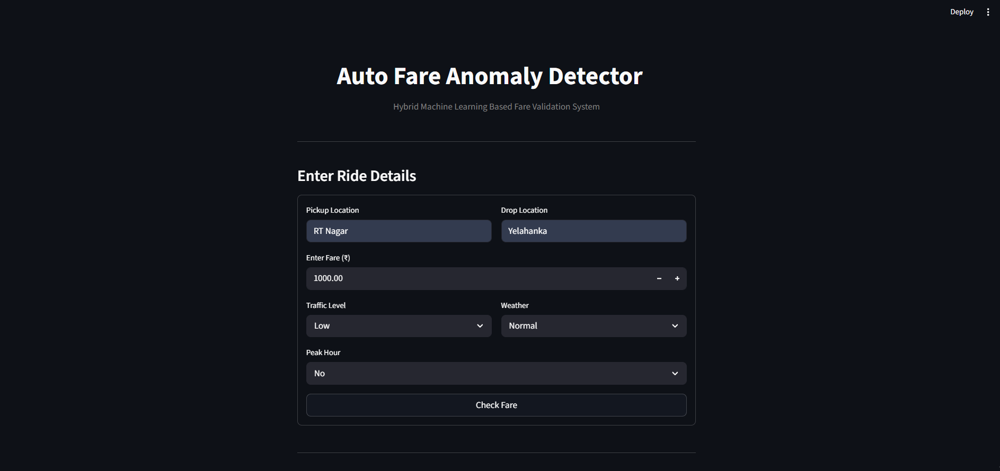
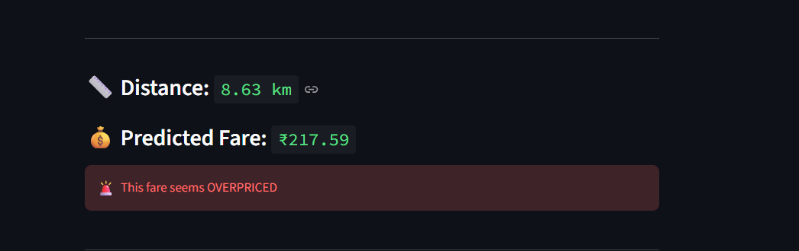
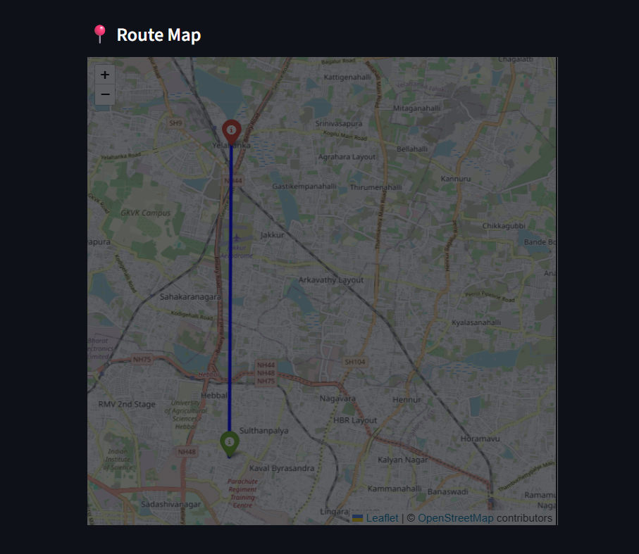
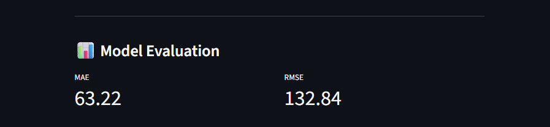

# 🚖 Auto Fare Anomaly Detector using Hybrid Machine Learning

An end-to-end Hybrid Machine Learning application that predicts expected auto-rickshaw fares and detects potential overcharging by combining supervised and unsupervised learning techniques with automated geospatial distance calculation and an interactive Streamlit dashboard.

---

## 📌 Project Overview

Passengers are often overcharged during auto-rickshaw rides due to the lack of transparent fare estimation systems. This project provides an intelligent solution that predicts the expected fare based on ride conditions and identifies whether the entered fare is fair or overpriced.

The application automatically calculates the travel distance between pickup and drop locations and performs fare prediction and anomaly detection in real time.

---

## ✨ Key Features

- 📍 Automatic distance calculation using Geopy
- 🧠 Hybrid Machine Learning approach
- 💰 Expected fare prediction
- 🚨 Overpriced fare detection
- 🗺 Interactive route map visualization
- 📊 Model evaluation metrics
- 💻 User-friendly Streamlit interface

---

## 🛠 Technologies Used

### Programming Language

- Python

### Frontend

- Streamlit

### Libraries

- NumPy
- Pandas
- Scikit-learn
- Geopy
- Folium
- Streamlit-Folium

---

# 🤖 Machine Learning Models

## Linear Regression (Supervised Learning)

Purpose:

Predicts the expected fare using:

- Distance
- Traffic Level
- Weather Condition
- Peak Hour

Output:

- Predicted Fare

---

## Isolation Forest (Unsupervised Learning)

Purpose:

Detects abnormal fare values.

Input:

- Distance
- Fare
- Fare per Kilometer

Output:

- Fair Ride
- Overpriced Ride

---

# 📊 Dataset

This project currently uses a synthetic dataset containing 500 auto-rickshaw rides.

The dataset includes:

- Distance
- Traffic
- Weather
- Peak Hour
- Fare

Artificial anomalies were introduced to simulate overcharging by increasing selected fares.

---

# ⚙ Project Workflow

1. User enters pickup location.
2. User enters drop location.
3. Distance is calculated using Geopy.
4. Features are generated.
5. Linear Regression predicts expected fare.
6. Isolation Forest detects anomalies.
7. Results are displayed.
8. Route map is visualized.
9. Evaluation metrics are shown.

---

# 📈 Model Evaluation

The application displays:

- Mean Absolute Error (MAE)
- Root Mean Square Error (RMSE)

These metrics evaluate the performance of the regression model.

---
---

## 📸 Application Showcases

### 🏠 1. User Interface & Input Form
*A clean user interface built with Streamlit allowing seamless entry of pickup points, drop locations, and trip environmental variables.*

<p align="center">
  
</p>

---

### 🧠 2. Hybrid ML Prediction & Anomaly Detection
*The core engine processing input data through Linear Regression for fare baseline estimation and Anomaly Detection to catch overcharging.*

<p align="center">
  
</p>

---

### 🗺️ 3. Interactive Route Mapping
*Dynamic visualization leveraging Geopy and Folium to plot paths, ensuring users visually audit their selected routes.*

<p align="center">
  
</p>

---

### 📈 4. Model Performance & Evaluation Metrics
*Transparency in data science. Displays real-time evaluation logs, including Mean Absolute Error (MAE) and Root Mean Square Error (RMSE).*

<p align="center">
  
</p>
# 📁 Project Structure

```
Auto-Fare-Anomaly-Detector
│
├── app.py
├── main.py
├── data_generator.py
├── requirements.txt
├── output_map.html
└── README.md
```

---

# 🚀 Installation

Clone the repository

```bash
git clone https://github.com/aymanzaara-tech/Auto-Fare-Anomaly-Detector.git
```

Move into the project directory

```bash
cd Auto-Fare-Anomaly-Detector
```

Install dependencies

```bash
pip install -r requirements.txt
```

Run the application

```bash
streamlit run app.py
```

---

# 🔮 Future Enhancements

- Integrate Google Maps API
- Real-time Traffic API
- Weather API
- Real-world datasets
- Improved prediction accuracy
- Android application
- Surge pricing prediction

---

# 👨‍💻 Author

**Ayman Zaara**

Machine Learning & Full Stack Developer

GitHub: https://github.com/aymanzaara-tech